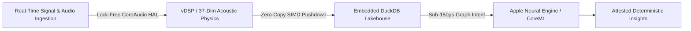

# Adam Scar McCoy
### Principal Software Architect • Real-Time Systems & Audio Intelligence • Sovereign Edge AI

---

## 🏛️ Executive Summary
Principal Software Architect specializing in **mission-critical low-latency systems**, **air-gapped sovereign AI pipelines**, and **high-throughput embedded analytical lakehouses (DuckDB/PyArrow)**. 

I help enterprise engineering organizations and venture-backed deep-tech teams eliminate thread contention bottlenecks, migrate multi-thousand-dollar cloud AI workloads to deterministic on-device hardware (Apple Silicon / CoreML), and design zero-copy data architectures.

---

## 📂 Core Case Studies & System Portfolios

### 1. 🎧 [Real-Time iOS Audio Engine & Low-Latency Architecture](https://github.com/adamscarmccoy-boop/Audio_ios_Case_Study)
* **Domain:** CoreAudio, AVFoundation HAL, C++11 Atomic Memory Barriers, Swift.
* **Breakthrough:** Lock-free Single-Producer Single-Consumer (SPSC) ring buffer architecture delivering **sub-2ms DSP loop latency** and a strict 64-frame hardware buffer with zero priority inversion.
* **Commercial Impact:** Replaces unstable prototype audio layers with a deterministic, zero-allocation real-time engine.

### 2. 🔒 [Sovereign Audio Intelligence & Edge AI Engine](https://github.com/adamscarmccoy-boop/sovereign-audio-intelligence)
* **Domain:** Apple Neural Engine, CoreML Quantization, Embedded DuckDB SIMD Lakehouse.
* **Breakthrough:** 37-dimensional acoustic mathematical extraction coupled with a zero-copy embedded columnar database (DuckDB) and sub-150µs local graph routing.
* **Commercial Impact:** 100% air-gapped compliance (zero cloud egress) with zero recurring API costs.

### 3. 🏛️ [Enterprise System Architecture & Diagnostic Audits](https://github.com/adamscarmccoy-boop/ADAMSCARMCCOY-CASE_STUDIES)
* **Domain:** Concurrency Audits, Vectorized Pushdown, Cloud-to-Edge AI Migration.
* **Breakthrough:** 3-layer diagnostic audit methodology eliminating thread contention, optimizing columnar database schemas, and reducing system memory footprints by >80%.

---

## 🔬 Architectural Moats & Core Competencies

* **Deterministic Real-Time Audio (CoreAudio / HAL):** Zero heap allocation (`malloc`/`free`) on the audio callback thread, lock-free ring buffers, and vDSP vector math.
* **Embedded Columnar Data Systems (DuckDB / PyArrow):** Ultra-fast SIMD analytical query pushdown over Parquet partitions directly in-process with zero socket overhead.
* **Sovereign & Edge ML (CoreML / ANE):** On-device model execution eliminating cloud latency, third-party data compliance liabilities, and API SaaS overhead.

---

## 💼 Engagement Models & Advisory Scope

| Engagement Type | Scope of Delivery | Typical Duration |
| :--- | :--- | :--- |
| **System Architecture Audit** | Deep-dive code/concurrency audit, latency profile, and bottleneck remediation blueprint. | 1 – 2 Weeks |
| **Edge AI / Real-Time Migration** | Porting high-cost cloud workflows to on-device CoreML / CoreAudio or embedded DuckDB pipelines. | 4 – 8 Weeks |
| **Fractional Principal Architect** | Strategic technical advisory, architectural governance, and high-level systems oversight. | Monthly Retainer |

---

## 📬 Direct Contact & Inquiries
* **Primary Contact:** [adamscarmccoy@gmail.com](mailto:adamscarmccoy@gmail.com)
* **GitHub Organization:** [@adamscarmccoy-boop](https://github.com/adamscarmccoy-boop)
* **Location / Availability:** US-Based • Open for Architecture Reviews, Vendor Engagements, and Fractional Advisory.
