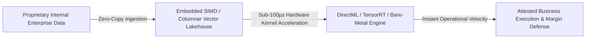

# Adam Scar McCoy
### Principal Systems & Performance Architect • Custom High-Velocity Data Engines

---

## 🏛️ Executive Statement

> **Enterprises don’t need more data; they need the speed to act on what they already own.**  
> **I build custom, high-velocity computational engines that eliminate operational friction—unlocking instant execution across your existing internal data assets with zero third-party vendor tax.**

---

## ⚡ The Four Executive Pillars

### 1. Unlocking Dormant Capital (Speed with Your Own Data)
Enterprises are data-rich but execution-starved. You already own the most valuable asset in the room—years of operational records, transaction history, and real-time signals. I eliminate the friction points across your operational layers, allowing your existing internal information to compute **instantaneously**.

### 2. Information Velocity as an Asymmetric Advantage
In any competitive market, the organization that processes information and serves decisions fastest captures market liquidity. Sluggish data layers lose deals before teams even realize a client looked. By engineering zero-waste, sub-millisecond execution paths, your business moves at the speed of reality.

### 3. Capital Efficiency: Balance-Sheet Equity vs. SaaS Rent
Most companies rent their intelligence, paying an endless "cloud tax" to external platforms for every query and computation. As operations scale, margins shrink. I design custom, owned computational engines that run directly on your hardware—turning variable SaaS expenses into **permanent, defensible balance-sheet equity**.

### 4. Absolute Operational Sovereignty
If your core business relies on someone else's servers, pricing changes, or API policies, you are a tenant in your own company. We build air-gapped, fully self-contained operational pipelines with **100% data sovereignty and zero external third-party risk**.

---

## 📂 Flagship Portfolios & High-Velocity Case Studies

| Flagship System | Core Domain | Architectural & Business Breakthrough |
| :--- | :--- | :--- |
| ⚡ **[`sovereign-audio-intelligence`](https://github.com/adamscarmccoy-boop/sovereign-audio-intelligence)** | High-Velocity Data & Edge Intelligence | Embedded DuckDB/PyArrow SIMD lakehouse querying millions of records in sub-12ms with zero cloud egress. |
| 🏛️ **[`ADAMSCARMCCOY-CASE_STUDIES`](https://github.com/adamscarmccoy-boop/ADAMSCARMCCOY-CASE_STUDIES)** | Enterprise System Audits & Optimization | 3-layer diagnostic audit methodology eliminating thread contention, memory bloat, and cutting cloud API costs by up to 85%. |
| 🏎️ **[`Audio_ios_Case_Study`](https://github.com/adamscarmccoy-boop/Audio_ios_Case_Study)** | Ultra-Low Latency Real-Time Systems | Lock-free Single-Producer Single-Consumer (SPSC) atomic ring buffers delivering sub-2ms deterministic loop throughput. |

---

## 🔬 High-Velocity Execution Architecture

---

## 💼 Engagement Models & Advisory Scope

| Engagement Type | Scope of Delivery | Typical Timeline |
| :--- | :--- | :--- |
| **System Architecture Audit** | Deep-dive code, memory, and concurrency audit; latency profiling; and bottleneck elimination blueprint. | 1 – 2 Weeks |
| **Custom Velocity Engine Migration** | Engineering hardware-direct, zero-copy data pipelines to process internal data locally at near-zero marginal cost. | 4 – 8 Weeks |
| **Fractional Principal Architect** | High-level technical governance, architectural strategy, and private operational retainers. | Monthly Retainer |

---

## 📬 Direct Executive Inquiries
* **Primary Contact:** [adamscarmccoy@gmail.com](mailto:adamscarmccoy@gmail.com)
* **GitHub Organization:** [@adamscarmccoy-boop](https://github.com/adamscarmccoy-boop)
* **Availability:** United States (Remote) • Open for Architecture Reviews & Retainer Engagements.
