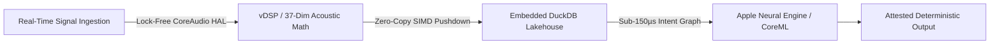

# Adam Scar McCoy
### Principal Software Architect • Low-Latency Audio Systems • Sovereign Edge AI

---

## ⚡ Flagship Systems & Deep-Dive Case Studies

| Flagship Repository | Domain & Architecture | Core Breakthrough |
| :--- | :--- | :--- |
| 🎧 **[`Audio_ios_Case_Study`](https://github.com/adamscarmccoy-boop/Audio_ios_Case_Study)** | Low-Latency CoreAudio & AVFoundation | Lock-free SPSC circular ring buffer, sub-2ms DSP loop, 64-frame HAL threshold. |
| 🔒 **[`sovereign-audio-intelligence`](https://github.com/adamscarmccoy-boop/sovereign-audio-intelligence)** | Air-Gapped Edge AI & Cognitive Audio | 37-dim acoustic math, embedded DuckDB/PyArrow SIMD lakehouse, sub-150µs LangGraph routing. |
| 🏛️ **[`ADAMSCARMCCOY-CASE_STUDIES`](https://github.com/adamscarmccoy-boop/ADAMSCARMCCOY-CASE_STUDIES)** | Enterprise System Architecture & Audits | Diagnostic audits for priority inversion elimination, zero-copy pushdown, and cloud cost slashing. |

---

## 🔬 Deep-Dive Architectural Competencies

### Core Moats
1. **Deterministic Audio Thread Safety:** Lock-free Single-Producer, Single-Consumer (SPSC) ring buffers with zero runtime allocations.
2. **Embedded Analytical Vectorization:** Sub-10ms analytical queries across millions of feature records using embedded DuckDB + PyArrow.
3. **Air-Gapped Sovereign AI:** On-device quantized model execution with zero cloud telemetry and zero marginal API fees.

---

## 💼 Direct Engagements & Consulting
Available for **architecture health audits**, **latency reduction sprints**, and **fractional advisory**.
* **GitHub:** [@adamscarmccoy-boop](https://github.com/adamscarmccoy-boop)
* **Engagements:** Real-time system audits, edge ML migrations, and audio engine engineering.
